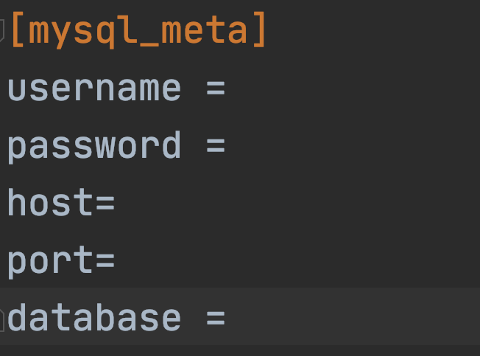

## DPSQL Project Deployment Guide

### Target

This article will introduce how to build and deploy the DPSQL project code as a runnable service.

### Deployment Process

#### 1.Service dependency package installation

Enter the project root directory and use pip install -r requirements.txt to install the complete pip package required by the service.

#### 2.MetaData storage preparation

When using DPSQL, it is necessary to maintain the MetaData information of the source  table to prepare for the sensitivity of noise-added calculations. This project uses Mysql to store the corresponding metadata information, so users need to create corresponding tables in their own Mysql database in advance (involving 4 tables, the table name and table structure are created according to the following script).

*1.metadata\_db*
```sql
create table metadata_db
(
    create_time int          null comment 'create time',
    status      tinyint      null comment 'the status of record; 0:deleted； 1:exist',
    id          bigint unsigned auto_increment comment 'primary key' primary key,
    prefix      varchar(200) not null comment 'prefix; could be psm/db_url/ip',
    db_name     varchar(100) not null comment 'database name',
    db_type     varchar(30)  not null comment 'database type'
) comment 'metadata_db' charset = utf8;

create index idx_prefix_dbname on metadata_db (prefix, db_name);
```

*2.metadata\_table*
```sql
create table metadata_table
(
    create_time      int             null comment 'create time',
    status           tinyint         null comment 'the status of record; 0:deleted； 1:exist',
    id               bigint unsigned auto_increment comment 'primary key' primary key,
    table_name       varchar(100)    not null comment 'table name',
    db_id            bigint unsigned not null comment 'the id of metadata_db',
    update_cycle     int             null comment 'the update cycle of metadata',
    last_update_time int             null comment 'last update time'
) comment 'metadata_table' charset = utf8;

create index idx_tablename_dbid on metadata_table (table_name, db_id);
```

*3.metadata\_column*
```sql
create table metadata_column
(
    create_time    int             null comment 'create time',
    status         smallint        null comment 'the status of record; 0:deleted； 1:exist',
    id             bigint unsigned auto_increment comment 'primary key' primary key,
    column_name    varchar(30)     not null comment 'column name',
    type           varchar(50)     not null comment 'column type',
    lower          varchar(30)     null comment 'the lower bound of column value',
    upper          varchar(30)     null comment 'the upper bound of column value',
    max_fre        varchar(10)     null comment 'the maximum frequency of column value',
    table_id       bigint unsigned not null comment 'id of metadata_table',
    clipping_flag  tinyint         null comment 'Whether to enable the clipping operation； 0：disable，1：enable',
    clipping_upper decimal(18, 3)  null comment 'the upper value of clipping',
    clipping_lower decimal(18, 3)  null comment 'the lower value of clipping'
) comment 'metadata_column' charset = utf8;

create index idx_tableid
    on metadata_column (table_id);
```

*4.metadata\_column\_map\_key\_metas*
```sql
create table metadata_column_map_key_metas
(
    create_time    int             null comment 'create time',
    status         smallint        null comment 'the status of record; 0:deleted； 1:exist',
    id             bigint unsigned auto_increment comment 'primary key' primary key,
    key_type       varchar(10)     not null comment 'key type',
    value_type     varchar(10)     not null comment 'value type',
    event_name     varchar(200)    null comment 'event for hive',
    event_lower    varchar(30)     not null comment 'lower bound of event',
    event_upper    varchar(30)     not null comment 'upper bound of event',
    name           varchar(100)    not null comment 'name',
    column_id      bigint unsigned not null comment 'id of metadata_column',
    clipping_flag  tinyint         null comment 'Whether to enable the clipping operation； 0：disable，1：enable',
    clipping_upper decimal(18, 3)  null comment 'the upper value of clipping',
    clipping_lower decimal(18, 3)  null comment 'the lower value of clipping'
) comment 'metadata_column_map_key_metas' charset = utf8;

create index idx_columnid on metadata_column_map_key_metas (column_id);
```

#### 3.Privacy budget consumption storage preparation

Using the DPSQL system, you can record the privacy budget consumption when querying table-level data. It is mainly recorded through Mysql, so it is necessary to use the following table creation script to generate a  table with the corresponding table name and table structure.

```sql
CREATE TABLE budget_info (
    prefix VARCHAR(100) NOT NULL,
    db_name VARCHAR(100) NOT NULL,
    table_name VARCHAR(100) NOT NULL,
    total_budget DOUBLE NOT NULL,
    consumed_budget DOUBLE NOT NULL,
    recover_cycle INT NOT NULL DEFAULT 30,
    exhausted_strategy VARCHAR(100) NOT NULL DEFAULT 'reject',
    create_time DATETIME NOT NULL,
    last_update_time DATETIME NOT NULL,
    last_recover_time DATETIME NOT NULL,
    slack DOUBLE NOT NULL DEFAULT 1e-18,
    num_dpcall INT NOT NULL DEFAULT 0,
    sum_eps DOUBLE NOT NULL DEFAULT 0.0,
    sum_del DOUBLE NOT NULL DEFAULT 0.0,
    sum_sq_eps DOUBLE NOT NULL DEFAULT 0.0,
    sum_exp_eps DOUBLE NOT NULL DEFAULT 0.0,
    prod_del DOUBLE NOT NULL DEFAULT 1.0,
    PRIMARY KEY (prefix, db_name, table_name)
);
```

#### 4.Database connection configuration

The databases used in DPSQL mainly include Mysql and Redis, so these two database connections need to be configured.

##### 1.Mysql

The Mysql configuration connection path mainly depends on where the user locates the MetaData and privacy budget consumption tables in deployment steps 2 and 3. Configure in utils/config/msql.ini in the project root directory.

(1)The url of the MetaData related database table prepared in step 2 of the mysql_meta section configuration


(2)The url of the privacy budget related database table in step 3 of the mysql_budget section configuration 


##### 2.redis

Configure in utils/config/redis.ini in the project root directory.

**Note:**：The redis strict connection mode is used in the DPSQL system, so the user needs to set a password when configuring redis

#### 5.start service

After completing the pre-preparation, run the bootstrap.sh script in the project root directory to start the service.


