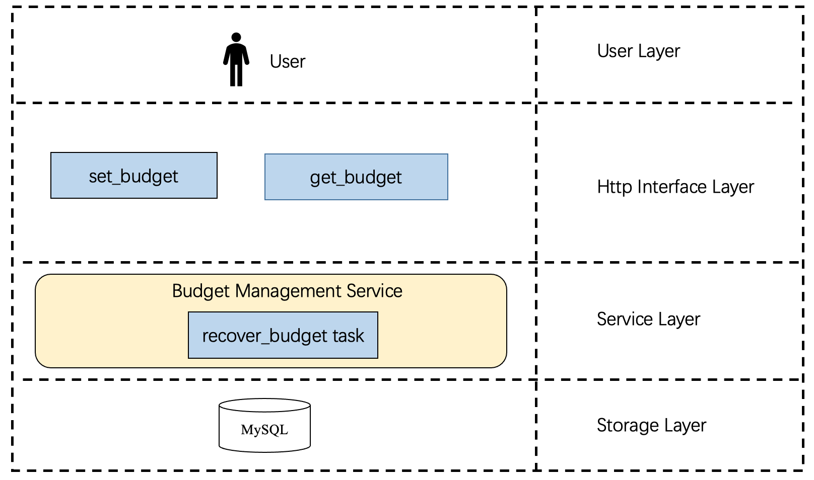

# 隐私预算管理模块设计

## 背景
为了满足用户自行管理数据集隐私预算、配置查询SQL隐私预算的需求，需要开发隐私预算配置功能。

## 目标
完成下述功能开发：
- table 的budget信息的管理（包括存储和增改查接口）
- 隐私预算的恢复：定时任务，隐私预算的恢复策略（设置恢复间隔天数）和策略的实行
- 支持对每次查询中的单个查询结果设定分配的隐私预算
- 记录每次查询的隐私预算的消耗（需要更新到mysql budget表信息） 

## 整体设计
隐私预算管理服务架构




## 接口设计
前置条件:
1. 存储budget info的数据库 和表格均已在DPSQL服务开启前，进行了初始化创建，格式如表格1所示。

<center><b><font size ='3'>表 1:  budget存储表格</font></b></center></font>

<table>
<thead>
  <tr>
    <th>列名</th>
    <th>说明</th>
    <th>类型</th>
    <th>备注</th>
  </tr>
</thead>
<tbody>
  <tr>
    <td>prefix</td>
    <td>数据库对应的host信息</td>
    <td>string</td>
    <td>不能为None</td>
  </tr>
  <tr>
    <td>db_name</td>
    <td>数据库名</td>
    <td>string</td>
    <td>不能为None</td>
  </tr>
  <tr>
    <td>table_name</td>
    <td>表名</td>
    <td>string</td>
    <td>不能为None</td>
  </tr>
  <tr>
    <td>total_budget</td>
    <td>隐私预算</td>
    <td>float</td>
    <td>不能为None</td>
  </tr>
  <tr>
    <td>consumed_budget</td>
    <td>已消耗的隐私预算</td>
    <td>float</td>
    <td>不能为None</td>
  </tr>
  <tr>
    <td>recover_cycle<br></td>
    <td>隐私预算恢复策略，即从服务运行开始，恢复隐私预算的天数<br></td>
    <td>int<br></td>
    <td>不能为None<br></td>
  </tr>
  <tr>
    <td>exhausted_strategy</td>
    <td>隐私预算耗尽时策略</td>
    <td>"reject" or "allow",&nbsp;&nbsp;&nbsp;&nbsp;&nbsp;&nbsp;# reject表示拒绝查询；allow表示允许查询，但此次查询消耗不做记录</td>
    <td>不以为None</td>
  </tr>
  <tr>
    <td>create_time<br></td>
    <td>本条记录的创建时间</td>
    <td>string<br></td>
    <td>不能为None</td>
  </tr>
  <tr>
    <td>last_update_time</td>
    <td>本条记录上次更新时间</td>
    <td>string</td>
    <td>不能为None</td>
  </tr>
  <tr>
    <td>last_recover_time<br></td>
    <td>本条记录的隐私预算的上次恢复时间</td>
    <td>string</td>
    <td>不能为空，第一次创建的时候，值等于create_time</td>
  </tr>
  <tr>
    <td>slack</td>
    <td rowspan="7">用于计算总体隐私预算消耗的参数集合<br></td>
    <td>float</td>
    <td rowspan="7">不能为空；<br>用户不能通过http接口直接更新这些参数<br></td>
  </tr>
  <tr>
    <td>num_dpcall</td>
    <td>int</td>
  </tr>
  <tr>
    <td>sum_eps</td>
    <td>float</td>
  </tr>
  <tr>
    <td>sum_del</td>
    <td>float</td>
  </tr>
  <tr>
    <td>sum_sq_eps</td>
    <td>float</td>
  </tr>
  <tr>
    <td>sum_exp_eps</td>
    <td>float</td>
  </tr>
  <tr>
    <td>prod_del</td>
    <td>float</td>
  </tr>
</tbody>
</table>


2. 在app.py中注册蓝图
```python
app.register_blueprint(budget, url_prefix='/api/v1/budget')
```

###设置总体隐私预算

- 请求路径:/set
- 请求方法: post
- 请求参数

<table>
<thead>
  <tr>
    <th>参数名</th>
    <th>参数说明</th>
    <th>类型</th>
    <th>备注</th>
  </tr>
</thead>
<tbody>
  <tr>
    <td>prefix</td>
    <td>数据库的host信息</td>
    <td>string</td>
    <td>不能为None</td>
  </tr>
  <tr>
    <td>db_name<br></td>
    <td>数据库名</td>
    <td>string</td>
    <td>不能为None<br></td>
  </tr>
  <tr>
    <td>table_name</td>
    <td>表名</td>
    <td>string</td>
    <td>不能为None</td>
  </tr>
  <tr>
    <td>total_budget</td>
    <td>隐私预算</td>
    <td>float</td>
    <td>可以为None，default=10000.0</td>
  </tr>
  <tr>
    <td>recover_cycle<br></td>
    <td>隐私预算恢复策略<br></td>
    <td>int，相邻两次隐私预算恢复时间间隔天数</td>
    <td>可以为None，default = 30</td>
  </tr>
  <tr>
    <td>exhausted_strategy<br></td>
    <td>隐私预算耗尽时策略<br></td>
    <td>string，"reject" or "allow",&nbsp;&nbsp;&nbsp;&nbsp;&nbsp;&nbsp;# reject表示拒绝查询；allow表示允许查询，但此次查询消耗不做记录</td>
    <td>可以为None，<br>default=“reject”</td>
  </tr>
</tbody>
</table>

```python
@views.route('/set', methods=['POST'])
def set_budget_info():
    
    return response

# 响应数据
// succeed
{
    status:{
        "code": 200, 
        "Message": "succeed"
    }
}

// 程序运行错误
{
  status:{
        "code": 1,
        "Message": error_info（程序具体运行错误原因）
    }
}

```

### 查询隐私预算信息
- 请求路径:/get
- 请求方法: get
- 请求参数

<table>
<thead>
  <tr>
    <th>参数名</th>
    <th>参数说明</th>
    <th>类型</th>
    <th>备注</th>
  </tr>
</thead>
<tbody>
  <tr>
    <td>prefix</td>
    <td>数据库的host信息</td>
    <td>string</td>
    <td>不能为None</td>
  </tr>
  <tr>
    <td>db_name</td>
    <td>数据库名</td>
    <td>string</td>
    <td>不能为None</td>
  </tr>
  <tr>
    <td>table_name</td>
    <td>表名</td>
    <td>string</td>
    <td>不能为None</td>
  </tr>
</tbody>
</table>


```python
@views.route('/get', methods=['GET'])
def get_budget_info(request):
    
    return response

# 响应数据
// 查询成功
{
     status:{
            "code": 200,
            "Message": "succeed",
            "data": {
                "prefix"：string，
                "db_name"：string，
                "table_name": string,
                "total_budget": float,
                "residual_budget": float,
                ...
            }
     }
}

// 数据库名或表名不存在
{
  status:{
        "code": 1,
        "Message": "budget info does not exist"
    }
}
```

### 用户为SQL的结果设置隐私预算 
用户通过在查询sql的key中配置budget信息来实现。
```python
key = {
    "sql": sql,
    "dbconfig": {
        "reader": "AnalysisBase",
        "psm": "olap.clickhouse.player_test01_lfxlq.service.lf",
        "database": "rangers",
        "sha256sum": "Sha256 checksum of database dp config",
        "queryOption": {
            "skip_cache": 1,
            "with_column_type": True
        }
    },
    "queryconfig": {
        "traceid": "traceid",
    },
    "dpconfig": { 
        "dp_method": "Gauss", # "Laplace" or "Gauss". Default value is "Laplace".
        "budget_setting": {
            "epsilon":  float，  # optimal, default = 0.9
            "delt": float,  # optimal, defaut=1e-8
        },
    },
    "extra": {
        "debug": True,
    }
}

```